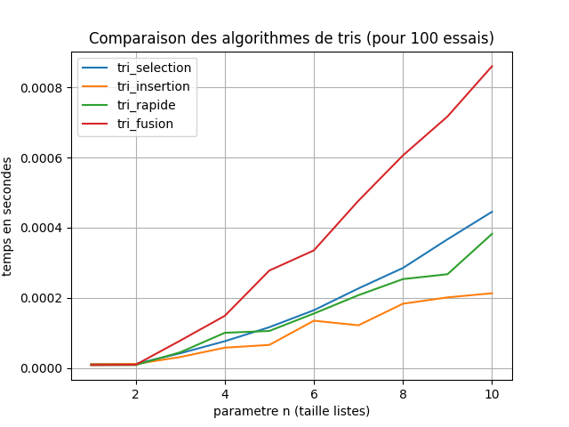
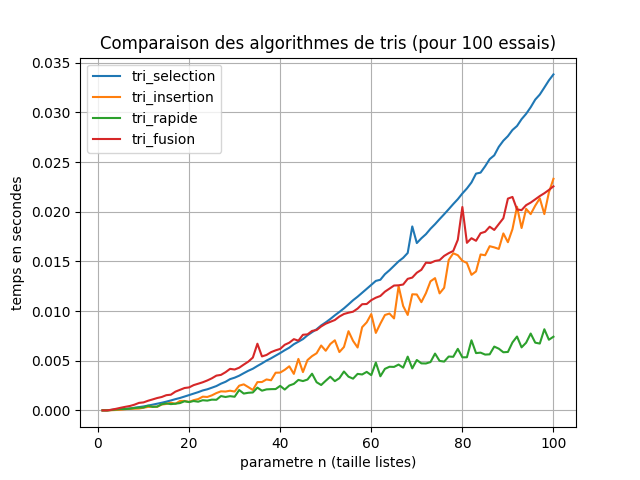
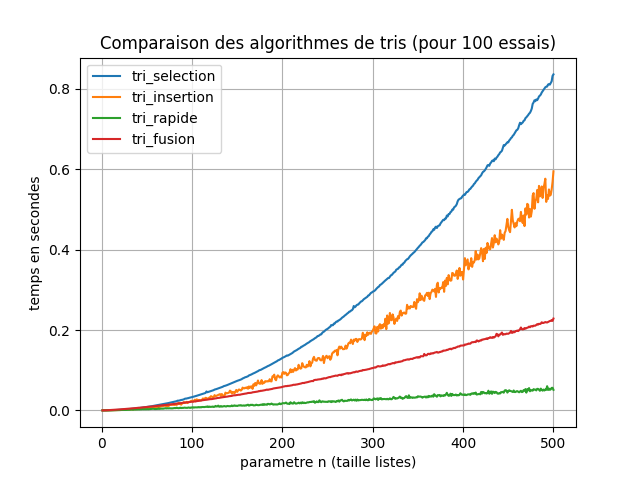
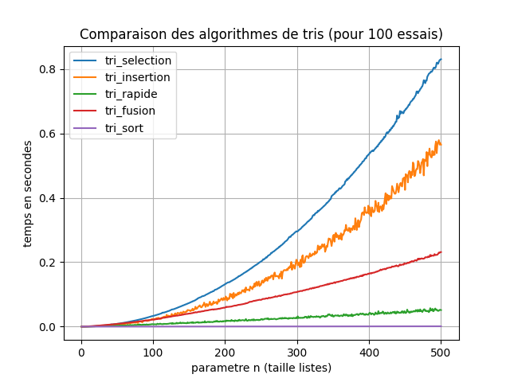

# Documentation de différentes méthodes de tri en python

[TOC]

## Tri selection

Le *tri selection* marche de la manière suivante:

- On cherche le minimum de la liste
- On l'échange avec le premier élément
- On cherche le minimum de la liste restante
- On l'échange avec le deuxième élément
- Et ainsi de suite

Exemple d'implémentation:

```python
def echanger(l, i, j):
    """
    :param l: (list) une liste 
    :param i, j: (int) deux indices
    :return: (NoneType) aucune
    :Effet de bord: échange les éléments d'indice i et j de l.
    :CU: 0 <= i,j < long(l)
    :Exemples:
    
    >>> l1 =  [3, 1, 4, 9, 5, 1, 2]
    >>> l2 = l1.copy()
    >>> echanger(l2, 3, 5)
    >>> (l1[3], l1[5]) == (l2[5], l2[3])
    True
    """
    l[i], l[j] = l[j], l[i]
    

def select_min(l, a, b, comp=compare):
    """
    :param l: (list) une liste
    :param a, b: (int) deux indices
    :param comp: (fonction) [optionnel] une fonction de comparaison
                   Valeur par défaut compare
    :return: (int) l'indice du minimum dans la tranche l[a:b]
    :CU: 0 <= a < b <= long(l),
         éléments de l comparables avec comp
    :Exemples:
    
    >>> select_min([1, 2, 3, 4, 5, 6, 7, 0], 0, 8)
    7
    >>> select_min([1, 2, 3, 4, 5, 6, 7, 0], 1, 7)
    1
    """
    ind_min = a
    # l'indice du plus petit élément de la tranche l[a:a+1] est ind_min
    for i in range(a + 1, b):
        # supposons que l'indice du plus petit élément de la
        # tranche l[a:i] est ind_min
        if comp(l[i], l[ind_min]) < 0:
            ind_min = i
        # alors l'indice du plus petit élément de la tranche l[a:i+1]
        # est ind_min
    # à l'issue de l'itération l'indice du plus petit élément de la tranche
    # l[a:b] est ind_min
    return ind_min


def tri_select(l, comp=compare):
    """
    :param l: (list) une liste à trier
    :param comp: (fonction) [optionnel] une fonction de comparaison
                             Valeur par défaut : compare
    :return: (NoneType) aucune
    :Effet de bord: modifie la liste l en triant ses éléments selon l'ordre défini par comp
          Algorithme du tri par sélection du minimum
    :CU: l liste homogène d'éléments comparables selon comp
    :Exemples:

    >>> l = [3, 1, 4, 1, 5, 9, 2]
    >>> tri_select(l)
    >>> l == [1, 1, 2, 3, 4, 5, 9]
    True
    >>> from random import randrange
    >>> l1 = [randrange(1000) for k in range(randrange(100))]
    >>> l2 = l1.copy()
    >>> tri_select(l2)
    >>> est_trie(l2)
    True
    >>> all(l1.count(elt) == l2.count(elt) for elt in l1)
    True
    >>> all(l1.count(elt) == l2.count(elt) for elt in l2)
    True
    """
    n = len(l)
    # la tranche l[0:1] est triée
    for i in range(n - 1):
        # supposons la tranche l[0:i+1] triée
        ind_min = select_min(l, i, n, comp=comp)
        echanger(l, i, ind_min)
        # alors la tranche l[0:i+2] est triée
    # à l'issue de l'itération la tranche l[0:n] est triée
```
exemple d'utilisation:

```python
l = [3, 1, 4, 1, 5, 9, 2]
tri_select(l)
print(l)

>> Output: [1, 1, 2, 3, 4, 5, 9]
```


## Tri insertion

Le *tri insertion* consiste à insérer chaque élément de la liste à sa place dans une liste déjà triée.


```python
def inserer(l, i, comp=compare):
    """
    :param l: (list) une liste
    :param i: (int) indice de l'élément de l à insérer dans l[0:i+1]
    :param comp: (fonction) [optionnel] une fonction de comparaison
                             Valeur par défaut : compare
    :return: (NoneType) aucune
    :Effet de bord: insère l'élément l[i] à sa place dans la tranche l[0:i+1]
             de sorte que cette tranche soit triée si l[0:i] l'est auparavant
    :CU: 0 <= i < long(l)
         éléments de l comparables par comp
         la tranche l[0:i] est triée
    :Exemples:

    >>> l = [1, 2, 4, 5, 3, 7, 6]
    >>> inserer(l, 4)
    >>> l == [1, 2, 3, 4, 5, 7, 6]
    True
    >>> inserer(l, 5)
    >>> l == [1, 2, 3, 4, 5, 7, 6]
    True
    >>> inserer(l, 6)
    >>> l == [1, 2, 3, 4, 5, 6, 7]
    True
    """
    aux = l[i]
    k = i
    while k >= 1 and comp(aux, l[k - 1]) < 0:
        l[k] = l[k - 1]
        k = k - 1    
    l[k] = aux

def tri_insert(l, comp=compare):
    """
    :param l: (list) une liste à trier
    :param comp: (fonction) [optionnel] une fonction de comparaison
    :return: (NoneType) aucune
    :Effet de bord : modifie la liste l en triant ses éléments selon l'ordre défini par comp
          Algorithme du tri par insertion
    :CU: l liste homogène d'éléments comparables selon comp
    :Exemples:

    >>> l = [3, 1, 4, 1, 5, 9, 2]
    >>> tri_insert(l)
    >>> l == [1, 1, 2, 3, 4, 5, 9]
    True
    >>> from random import randrange
    >>> l1 = [randrange(1000) for k in range(randrange(100))]
    >>> l2 = l1.copy()
    >>> tri_insert(l2)
    >>> est_trie(l2)
    True
    >>> all(l1.count(elt) == l2.count(elt) for elt in l1)
    True
    >>> all(l1.count(elt) == l2.count(elt) for elt in l2)
    True
    """
    n = len(l)
    # la tranche l[0:1] est triée
    for i in range(1, n):
        # supposons la tranche l[0:i] triée
        inserer (l, i, comp=comp)
        # alors la tranche l[0:i+1] est triée
    # à l'issue de l'itération la tranche l[0:n] est triée
```

exemple d'utilisation:

```python
l = [3, 1, 4, 1, 5, 9, 2]
tri_insert(l)
print(l)

>> Output: [1, 1, 2, 3, 4, 5, 9]
```

## Tri rapide

Le *tri rapide* fonctionne de la manière suivante:

- On choisit un élément de la liste
- On partitionne la liste en deux parties: les éléments plus petits que l'élément choisi, et les éléments plus grands
- On trie récursivement les deux parties


```python
def partitionner(l, debut, fin, comp=compare):
    '''
    :param l: (list) liste à partitionner
    :param debut, fin: (int) indices de début et de fin de la tranche de l
                       à partionner
    :return: (int) indice où se trouve le pivot (initialement à l'indice debut)
                   après le partionnement
    :effet de bord: après partionnement tous les éléments de la tranche l[debut:fin]
                    ont été déplacés de sorte que ceux situés à gauche du pivot soient
                    situés à sa gauche, et les autres à sa droite
    :CU: 0 <= debut < fin <= len(l)
    :Exemples:

    >>> l = [3, 1, 4, 1, 5, 9, 2]
    >>> ind_pivot = partitionner(l, 2, 6)
    >>> ind_pivot
    3
    >>> l
    [3, 1, 1, 4, 5, 9, 2]
    '''
    pivot = l[debut]
    ind_pivot = debut
    for i in range (debut+1, fin):
        if comp(pivot, l[i]) > 0:
            l[ind_pivot] = l[i]
            l[i] = l[ind_pivot+1]
            ind_pivot += 1
    l[ind_pivot] = pivot
    return ind_pivot

def tri_rapide(l, debut=0, fin=None, comp=compare):
    """
    :param l: (list) une liste à trier
    :param comp: (fonction) [optionnel] une fonction de comparaison
    :param debut, fin: (int) [optionnel] indices délimitant la tranche à trier
    :return: (NoneType) aucune
    :Effet de bord : modifie la liste l en triant 
          les éléments de la tranche l[debut:fin] selon l'ordre défini par comp
          Algorithme du tri rapide
    :CU: l liste homogène d'éléments comparables selon comp
    :Exemples:

    >>> l = [3, 1, 4, 1, 5, 9, 2]
    >>> tri_rapide(l)
    >>> l == [1, 1, 2, 3, 4, 5, 9]
    True
    >>> from random import randrange
    >>> l1 = [randrange(1000) for k in range(randrange(100))]
    >>> l2 = l1.copy()
    >>> tri_rapide(l2)
    >>> est_trie(l2)
    True
    >>> all(l1.count(elt) == l2.count(elt) for elt in l1)
    True
    >>> all(l1.count(elt) == l2.count(elt) for elt in l2)
    True
    """
    if fin is None: fin = len(l)
    if fin - debut > 1:
        ind_pivot = partitionner(l, debut, fin, comp=comp)
        tri_rapide(l, debut=debut, fin=ind_pivot, comp=comp)
        tri_rapide(l, debut=ind_pivot+1, fin=fin, comp=comp)
```

exemple d'utilisation:

```python
l = [3, 1, 4, 1, 5, 9, 2]
tri_rapide(l)
print(l)

>> Output: [1, 1, 2, 3, 4, 5, 9]
```

## Tri fusion

Le *tri fusion* fonctionne de la manière suivante:

- On divise la liste en deux parties
- On trie récursivement les deux parties
- On fusionne les deux parties triées

```python
def separer(l):
    """
    :param l: (list) liste à séparer en deux
    :return: (tuple) couple de listes d'égales longueurs (à 1 près)
    :CU: aucune
    :Exemples:

    >>> l = [3, 1, 4, 1, 5, 9, 2]
    >>> l1, l2 = separer(l)
    >>> l3 = l1 + l2
    >>> len(l3) == len(l)
    True
    >>> all(k in l for k in l3)
    True
    >>> all(k in l3 for k in l)
    True
    """
    n = len(l)
    if n == 0:
        return ([], [])
    elif n == 1:
        return ([l[0]], [])
    else:
        l1, l2 = separer(l[2:])
        return ([l[0]] + l1, [l[1]] + l2)
    # autre possibilité
    # return (l[0:n//2], l[n//2:])

def fusionner(l1, l2, comp=compare):
    """
    :param l1, l2: (list) deux listes (supposées triées)
    :param comp: (optional) une fonction de comparaison
    :return: (list) une liste contenant les éléments de l1 et l2
              cette liste est triée si l1 et l2 le sont
    :UC: les éléments de l1 et l2 doivent être comparables selon comp
    :Exemples:

    >>> fusionner([1, 3, 4, 9], [1, 2, 5])
    [1, 1, 2, 3, 4, 5, 9]
    """
    if l1 == []:
        return l2.copy()
    elif l2 == []:
        return l1.copy()
    else:
        cmp = comp(l1[0], l2[0])
        if cmp <= 0:
            return [l1[0]] + fusionner(l1[1:], l2, comp=comp)
        else:
            return [l2[0]] + fusionner(l1, l2[1:], comp=comp)

def tri_fusion(l, comp=compare):
    """
    :param l: (list) une liste à trier
    :param comp: (fonction) [optionnel] une fonction de comparaison
                             Valeur par défaut : compare
    :return: (list) 
    :Effet de bord: aucun
          Algorithme du tri fusion
    :CU: l liste homogène d'éléments comparables selon comp
    :Exemples:

    >>> l = [3, 1, 4, 1, 5, 9, 2]
    >>> l2 = tri_fusion(l)
    >>> l2 == [1, 1, 2, 3, 4, 5, 9]
    True
    >>> from random import randrange
    >>> l1 = [randrange(1000) for k in range(randrange(100))]
    >>> l2 = tri_fusion(l1)
    >>> est_trie(l2)
    True
    >>> all(l1.count(elt) == l2.count(elt) for elt in l1)
    True
    >>> all(l1.count(elt) == l2.count(elt) for elt in l2)
    True    """
    n = len(l)
    if n <= 1:
        return l.copy()
    else:
        l1, l2 = separer(l)
        l1s = tri_fusion(l1, comp=comp)
        l2s = tri_fusion(l2, comp=comp)
        return fusionner(l1s, l2s, comp=comp)
```

exemple d'utilisation:

```python
l = [3, 1, 4, 1, 5, 9, 2]
l2 = tri_fusion(l)
print(l2)

>> Output: [1, 1, 2, 3, 4, 5, 9]
```

<br>

# Analyse temporelle de méthodes de tri

## Introduction

Ce document donne une comparaison des tris suivants:

- Tri **séléction**
- Tri **insertion**
- Tri **rapide**
- Tri **fusion**

## Méthode

Pour mesurer le temps d'exécution des algorithmes, nous utilisons la bibliothèque Python `timeit` afin d'exécuter plusieurs fois chaque fonction de tri avec des listes de tailles croissantes générées aléatoirement. Chaque fonction est exécutée 100 fois, et le temps moyen est calculé pour chaque taille de liste `n`.

Les listes testées sont de tailles croissantes allant de 1 à 500 éléments. Voici les algorithmes testés :

- **Tri sélection** : Algorithme peu efficace pour les grandes listes. Il parcourt la liste pour trouver le plus petit élément à chaque itération.
  
- **Tri insertion** : L'algorithme insère chaque nouvel élément à sa place dans une liste déjà triée.

- **Tri rapide** : Un des algorithmes de tri les plus efficaces. Partitionne la liste et tri chaque sous-liste.

- **Tri fusion** : Division de la liste en sous-listes plus petites, puis fusion une fois triées.


## Comparaison des résultats


*Figure 1 : Graphique comparant les temps d'exécution des différents algorithmes de tri pour des listes de tailles croissantes. Pour 100 essais et n=10*


*Figure 2 : Graphique comparant les temps d'exécution des différents algorithmes de tri pour des listes de tailles croissantes. Pour 100 essais et n=100*


*Figure 3 : Graphique comparant les temps d'exécution des différents algorithmes de tri pour des listes de tailles croissantes. Pour 100 essais et n=500*

## Comparaison avec la méthode sort


*Figure 4 : Graphique comparant les temps d'exécution des différents algorithmes de tri pour des listes de tailles croissantes, avec la courbe de la méthode sort incluse Pour 100 essais et n=500*

## Conclusion

Avec les résultats, nous pouvons voir que :

- Le tri sort est le plus performant, avec une valeur temporelle proche de 0 (Figure 4)
- Des 4 algo, le tri insertion semble être plus efficace pour une petite liste (Figure 1)
- L'algorithme de tri rapide est plus efficace que les tris fusion, sélection et insertion pour des listes de taille moyenne à grande.