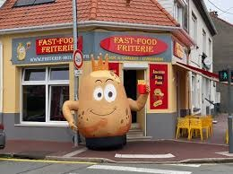
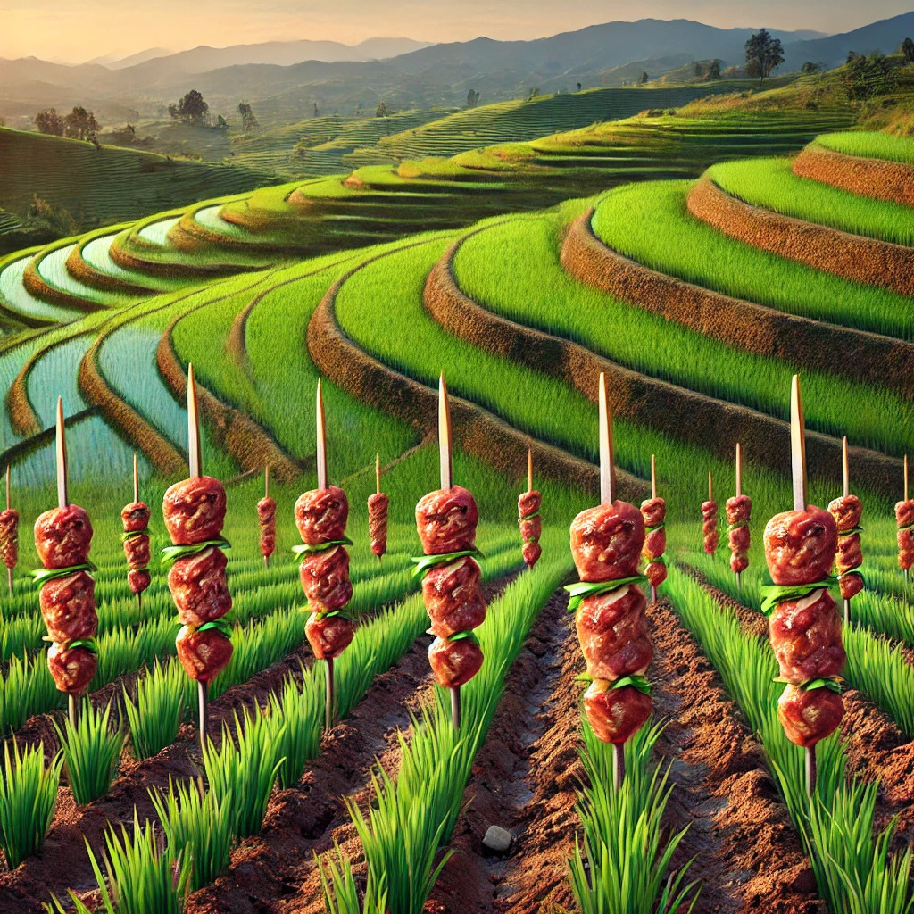

<!-- # Friterie Molliens

Devanture de la patate mollien:

## Menu

- frites
- frites
- frites

  -->

# Les Champs de Kebab en Asie

## Introduction
Oubliez les rizières en terrasses ou les vastes champs de blé. En Asie, un phénomène agricole révolutionnaire a vu le jour : les **champs de kebabs**. Dans ces terres miraculeuses, les kebabs ne sont plus simplement cuisinés, ils poussent littéralement sur les tiges, prêts à être cueillis. Un rêve devenu réalité pour les amateurs de grillades !

## La Culture du Kebab

### 1. **Préparation du Sol**
Les sols des champs de kebabs sont soigneusement enrichis avec des épices exotiques, allant de la coriandre à la cannelle, en passant par le paprika. Une pincée de cumin et de curcuma est répandue à la main, garantissant que chaque kebab soit non seulement tendre, mais aussi intensément savoureux.

### 2. **Les Graines de Kebab**
Les graines de kebab sont plantées dans des lignes parfaitement droites, un peu comme celles des vignobles. Elles prennent racine profondément dans le sol fertile, et en quelques semaines, on voit apparaître les premiers **brochetons**, ces petites tiges porteuses de mini-kebabs qui ne demandent qu’à grandir.

## Le Cycle de Croissance du Kebab

- **Étape 1 : La Germination**  
  Dès la première pluie de sauce blanche, les petites pousses de kebab percent le sol. Elles s'étendent vers le ciel, nourries par les rayons du soleil qui leur confèrent cette belle coloration dorée.

- **Étape 2 : La Floraison des Brochettes**  
  Au printemps, les brochettes commencent à bourgeonner. Certaines variétés donnent des **Döner**, tandis que d'autres produisent des **Shish kebabs**. Les agriculteurs veillent à arroser régulièrement les champs avec de la sauce harissa pour stimuler la saveur épicée.

- **Étape 3 : La Récolte**  
  La récolte des kebabs est une fête dans les villages. Les agriculteurs, armés de grandes fourchettes, se faufilent entre les rangées pour cueillir les kebabs mûrs, directement grillés sur les branches. Une fois récoltés, les kebabs sont triés : certains destinés aux sandwichs, d’autres aux assiettes généreuses.

## Les Ennemis Naturels des Champs de Kebab

### 1. **La Moussaka Sauvage**
Cousin éloigné de l’aubergine, la **moussaka sauvage** est un redoutable parasite. Elle s'infiltre entre les kebabs et tente de voler leur jus grillé. Les agriculteurs doivent souvent intervenir avec des jets de citron pour la tenir à distance.

### 2. **Les Vaches Tzatziki**
Ces créatures, bien que mignonnes, vagabondent à la recherche de kebabs juteux. Elles sont attirées par les odeurs et se déplacent en troupeaux pour engloutir les récoltes. Il est impératif de les éloigner avec des clôtures d'oignons rouges.

## Conclusion
Les champs de kebabs en Asie sont une véritable merveille culinaire, un miracle de la nature et de la gourmandise. Alors, la prochaine fois que vous savourez un kebab, n’oubliez pas qu’il a peut-être été cueilli avec amour dans l’un de ces champs magiques, où la viande grille directement sous les doux rayons du soleil asiatique.

Bon appétit et bonne cueillette !
